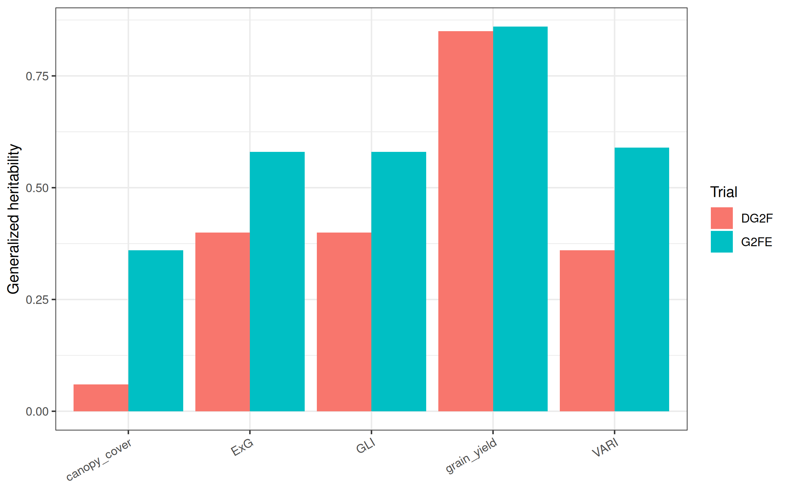
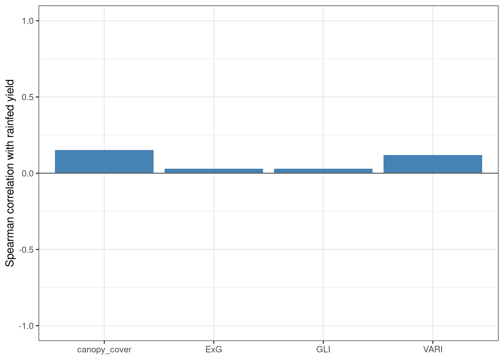

```{r}
#| label: setup

library(here)
library(dplyr)

processed_dir <- here("data", "processed")

trial <- read.csv(file.path(processed_dir, "trial_metadata.csv"))
plot_data <- read.csv(file.path(processed_dir, "plot_data_20170420.csv"))
h2 <- read.csv(file.path(processed_dir, "heritability.csv"))
rank_cor <- read.csv(file.path(processed_dir, "rank_correlations.csv"))
selection <- read.csv(file.path(processed_dir, "selection.csv"))
comparison <- read.csv(file.path(processed_dir, "treatment_comparison.csv"))
yield_resp <- read.csv(file.path(processed_dir, "yield_response.csv"))

# Unit of the YieldMoist column in the field notes
yield_unit <- "[UNIT TO CONFIRM]"

uav_traits <- c("canopy_cover", "ExG", "GLI", "VARI")
trait_label <- c(
  canopy_cover = "canopy cover", ExG = "ExG", GLI = "GLI",
  VARI = "VARI", grain_yield = "grain yield"
)

f1 <- function(x) formatC(x, format = "f", digits = 1)
f2 <- function(x) formatC(x, format = "f", digits = 2)
pc <- function(x) paste0(formatC(100 * x, format = "f", digits = 1), "%")
get_h2 <- function(env, tr) h2$heritability[h2$environment == env & h2$trait == tr]


# Trial and join
n_plots <- table(trial$environment)
n_poly <- n_distinct(plot_data$plot_id)
n_matched <- n_distinct(plot_data$plot_id[!is.na(plot_data$environment)])


# Heritability
h2_uav <- filter(h2, trait %in% uav_traits)
h2_irr <- filter(h2_uav, environment == "G2FE")
h2_rf <- filter(h2_uav, environment == "DG2F")
n_h2_lower <- sum(sapply(uav_traits, function(t) get_h2("DG2F", t) < get_h2("G2FE", t)))
exg_gli_same <- all(sapply(c("G2FE", "DG2F"), function(e) {
  abs(get_h2(e, "ExG") - get_h2(e, "GLI")) < 0.005
}))


# Rank agreement and selection
rho_top <- rank_cor[which.max(rank_cor$spearman), ]
sel10 <- filter(selection, abs(intensity - 0.10) < 1e-9)
sel20 <- filter(selection, abs(intensity - 0.20) < 1e-9)
ret_top <- sel20[which.max(sel20$retention), ]


# Irrigated against rainfed
yc <- filter(comparison, trait == "grain_yield")
yield_reduction <- 1 - yc$rainfed_mean / yc$irrigated_mean
n_lower_rf <- sum(yield_resp$yield_difference > 0)
```

# Introduction

A breeder running a drought nursery has to decide which hybrids to advance, and grain yield is only measured at harvest. Unmanned aerial vehicle (UAV) flights record the canopy from early in the season, so plot-level traits taken from those images could rank hybrids months before the combine enters the field. The practical test is whether that early ranking agrees with the final ranking on rainfed grain yield once both are corrected for spatial variation within the trial.

This report applies that test to a single flight as it uses the RGB mosaic of 20 April 2017 from the Genomes to Fields (G2F) trial at College Station, Texas [@murray2019], and carries it from the mosaic through to a culling decision. The work was limited to one date so that each step, from plot polygons to spatial models and selection measures, could be checked end to end before scaling up to the season. Hence, the result shows whether this particular flight carries a useful ranking. It cannot show how early in the season such a ranking first appears, because that question needs the remaining flight dates.

The project starts by describing the trial and the files used, then sets out the image processing and statistical models, and finally reports heritability, rank agreement with rainfed yield and selection outcomes for the single flight. The objectives were to:

- extract plot-level canopy cover, excess green (ExG), green leaf index (GLI) and visible atmospherically resistant index (VARI) from the 20 April 2017 mosaic using the supplied plot shapefiles;
- fit spatially corrected models within the irrigated and rainfed trials and estimate generalized heritability for each UAV trait and for grain yield;
- test whether ranking hybrids on each UAV trait reproduces their ranking on rainfed grain yield, using Spearman correlation and coincidence of selection at 10% and 20% intensity;
- compare genotype means between the irrigated and rainfed trials for grain yield and each UAV trait.

# Data

The G2F College Station 2017 UAV dataset covers 1,500 two-row plots, made up of 250 genotypes grown in three management environments with two replicates each [@murray2019]. Two of those environments were used here: the irrigated trial, coded G2FE, and the rainfed trial, coded DG2F. The late-planted trial was left out because the contrast between irrigated and rainfed management is the one that bears on selection for yield under water deficit.

Three files from the dataset were used. The field notes (CS17_G2F_FieldNotes.csv) supplied the plot barcode, pedigree, replicate, range, row and grain yield of each plot; after filtering to the two trials, they held `r n_plots[["G2FE"]]` irrigated and `r n_plots[["DG2F"]]` rainfed plots. The shapefile of each trial supplied the plot boundaries, and the RGB mosaic from the fixed-wing flight of 20 April 2017 supplied the canopy image. Raw images, point clouds and digital surface models were not downloaded because none of them was needed for a single RGB date.

Grain yield was used as recorded in the YieldMoist column of the field notes, in `r yield_unit`, with no further moisture adjustment or outlier screening. Hence, the yield values carry whatever cleaning the field notes had at release. These values may differ slightly from the outlier-removed plot records in the separate G2F phenotype release, which was not used here.

# Methods

This section follows the order of the numbered scripts in the repository, from plot polygons to the selection measures.

## Plot polygons

The two trial shapefiles were combined into one layer and assigned the WGS 84 / UTM zone 14N coordinate reference system (EPSG:32614), which is the system of the mosaic. Each polygon was then shrunk by an inward buffer of 0.20 m. This was done to keep plot edges, alleys and leaves overhanging from neighbouring plots out of the plot values. The buffer width was not varied; hence every extracted value, and every estimate built on it, is conditional on this choice.

## Vegetation indices

The mosaic was cropped to the extent of the buffered plots, and each of the red, green and blue bands was divided by the sum of the three. This converts the bands to chromatic coordinates (*r*, *g*, *b*) and reduces the effect of brightness differences across the mosaic; RGB mosaics of this kind store camera values and are not calibrated to reflectance. Three indices were computed from the normalized bands:

$$
\text{ExG} = 2g - r - b, \qquad
\text{GLI} = \frac{2g - r - b}{2g + r + b}, \qquad
\text{VARI} = \frac{g - r}{g + r - b}
$$

Excess green follows @woebbecke1995, the green leaf index follows @louhaichi2001 and VARI follows @gitelson2002. Cells where the band sum or the VARI denominator was zero were set to missing, since both cases would otherwise give a division by zero.

## Plot-level extraction

Cells with ExG above zero were classed as vegetation and the remaining cells as soil or residue. Canopy cover for each plot was taken as the share of vegetation cells inside the buffered polygon. ExG, GLI and VARI were averaged over vegetation cells only, so that bare soil between the rows does not pull the index means toward the soil value. Means were weighted by the fraction of each cell lying inside the polygon, because cells cut by the plot boundary would otherwise count as fully inside it. The ExG threshold of zero was set in advance and was not tuned against the image.

Of the `r n_poly` plot polygons, `r n_matched` matched a field-note record through the plot barcode. These plots carried their genotype, replicate, range and row into the models.

## Spatially corrected models

Each trait was analysed separately within each trial using SpATS, which fits a two-dimensional P-spline surface over the field to absorb spatial trends [@rodriguez2018]. Replicate entered as a fixed effect, and the spatial surface was fitted over row and range with ten segments in each direction. Every trait and trial combination was fitted twice. With genotype as random, the model gave generalized heritability, computed from the effective dimension of the genotype term. With genotype as fixed, it gave best linear unbiased estimates (BLUEs) of genotype means, which were used for all the ranking work. Heritability was not taken from the fixed-genotype model because that model does not estimate a genetic variance. Grain yield was modelled in the same way.

## Ranking and selection

Ranking was done within the rainfed trial, since the decision being tested is selection for yield under rainfed conditions. For each UAV trait, the Spearman rank correlation was computed between its BLUEs and the rainfed grain yield BLUEs across the genotypes that had both. Two selection measures were then calculated. Coincidence of selection is the share of the top *k* genotypes for grain yield that also fall in the top *k* for the UAV trait, with *k* set to 10% or 20% of the genotypes and rounded up. Under random ranking, coincidence is expected to equal the selection intensity. Retention is the share of the same top yielders that survive when the bottom half of the trial is culled on the UAV trait; under random ranking it is expected to be about 50%.

All traits were ranked with higher values taken as better. This is a reasonable assumption for canopy greenness and cover early in the season, though a trait with a negative relationship to yield would score below chance on both measures.

## Irrigated and rainfed comparison

Genotype BLUEs from the two trials were paired for grain yield and for each UAV trait. For each trait, the trial means and the Spearman correlation between trials were computed. For grain yield, the proportional reduction of each genotype was also calculated as one minus the ratio of its rainfed BLUE to its irrigated BLUE.

# Results

The results follow the order of the questions: first the yield contrast between the two trials, then the heritability of each trait, and finally how well each trait ranked hybrids for rainfed yield.

## Irrigated and rainfed yield

Mean grain yield across the `r yc$n_genotypes` paired genotypes was `r f1(yc$irrigated_mean)` `r yield_unit` under irrigation and `r f1(yc$rainfed_mean)` `r yield_unit` under rainfed management, a reduction of `r pc(yield_reduction)`. In total, `r n_lower_rf` of the `r nrow(yield_resp)` genotypes yielded less under rainfed management. The Spearman correlation between irrigated and rainfed yield BLUEs was `r f2(yc$spearman)`, which indicates `r if (yc$spearman >= 0.7) "that genotypes largely kept their rank order across the two trials" else if (yc$spearman >= 0.4) "partial agreement in genotype rank order between the two trials" else "that genotypes changed rank considerably between the two trials"`. `r if (yield_reduction >= 0.10) "A reduction of this size is consistent with the rainfed trial having experienced water deficit, though soil water was not measured here." else "A reduction this small suggests that the rainfed trial may not have experienced strong water deficit in 2017. Hence, the rainfed ranking below describes performance under local rainfed conditions, and it may say little about drought tolerance as such."`

## Heritability

Grain yield had the highest generalized heritability in both trials, at `r f2(get_h2("G2FE", "grain_yield"))` under irrigation and `r f2(get_h2("DG2F", "grain_yield"))` under rainfed management (@fig-h2). The UAV traits ranged from `r f2(min(h2_irr$heritability))` to `r f2(max(h2_irr$heritability))` in the irrigated trial and from `r f2(min(h2_rf$heritability))` to `r f2(max(h2_rf$heritability))` in the rainfed trial. For `r n_h2_lower` of the four UAV traits, heritability was lower in the rainfed trial than in the irrigated trial. The lowest value was for `r trait_label[[h2_rf$trait[which.min(h2_rf$heritability)]]]` under rainfed management, at `r f2(min(h2_rf$heritability))`.

ExG and GLI returned `r if (exg_gli_same) "the same heritability to two decimal places" else "very similar heritability"` in both trials. This is expected from the normalization. Because *r* + *g* + *b* = 1, the GLI denominator reduces to 1 + *g*, so GLI is ExG divided by a quantity that varies little among vegetation cells; the two indices therefore rank plots in almost the same order.

{#fig-h2}

## Rank agreement with rainfed yield

Across `r max(rank_cor$n_genotypes)` rainfed genotypes, the Spearman correlation between UAV trait BLUEs and rainfed grain yield BLUEs ranged from `r f2(min(rank_cor$spearman))` to `r f2(max(rank_cor$spearman))` (@fig-rank). The highest correlation was for `r trait_label[[rho_top$trait]]`. Correlations of this size indicate that the 20 April ranking on any of the four traits was close to independent of the final ranking on rainfed grain yield.

{#fig-rank}

## Selection outcomes

At 10% intensity, the target was the top `r sel10$n_selected[1]` genotypes for rainfed yield. Coincidence ranged from `r pc(min(sel10$coincidence))` to `r pc(max(sel10$coincidence))` across the four traits, against an expectation of 10% under random ranking (@fig-sel). At 20% intensity, with `r sel20$n_selected[1]` target genotypes, coincidence ranged from `r pc(min(sel20$coincidence))` to `r pc(max(sel20$coincidence))` against an expectation of 20%. Culling the bottom half of the trial on each trait retained between `r pc(min(sel20$retention))` and `r pc(max(sel20$retention))` of the top 20% of yielders, against an expectation of about 50%. The highest retention came from `r trait_label[[ret_top$trait]]`.

{#fig-sel}

# Discussion

We first interpret the ranking result, then consider why heritability and rank agreement diverged, and finally set out the choices that limit how far the result can be taken.

The 20 April flight did not rank hybrids for rainfed grain yield well enough to support a cull. Rank correlations were weak for all four traits, and coincidence and retention sat close to the values expected from random ranking (@fig-rank; @fig-sel). As a result, culling half of the rainfed trial on any of these traits at this date would likely have discarded about as many of the eventual top yielders as a random cull. This is a negative result for one date only. It says nothing yet about later flights, when the canopy is closer to flowering and grain filling.

Interestingly, the weak rank agreement does not appear to be a problem of measurement noise alone. The heritability of the UAV traits under irrigation indicates that genotypes differed repeatably in early canopy greenness and cover once spatial trends were removed (@fig-h2). Hence, the weak link to yield more likely arises because early canopy traits and final grain yield rank the genotypes in different orders. This is consistent with the time gap between the flight and grain formation; an early image records early vigour, while rainfed yield also depends on growth after flowering that such an image cannot capture. The present data cannot separate these explanations, and the later flights are needed to test whether the correlation rises as the season advances.

Heritability of the UAV traits was lower under rainfed management, and canopy cover in the rainfed trial had a heritability of only `r f2(get_h2("DG2F", "canopy_cover"))`. This may reflect more uneven emergence or early growth across the rainfed field, which would add plot-to-plot variation that the spatial surface does not absorb. It may also reflect the fixed ExG threshold; a threshold of zero that separates canopy from soil well in the irrigated trial could misclassify thin canopies in the rainfed trial. Neither explanation was tested here. Checking the vegetation mask over a sample of rainfed plots, and comparing a few thresholds, would be the first step in telling them apart.

Several settings in this analysis were fixed once and each one limits how far the numbers can be taken. The 0.20 m buffer and the ExG threshold were not varied; hence the extracted values, and the heritability estimates built on them, may shift under other settings. Heritability and BLUEs came from one implementation, SpATS, with no cross-check against a second mixed-model package. Grain yield came from the field notes and not from the outlier-screened G2F phenotype release. Again, every trait was ranked with higher values taken as better, which is reasonable early in the season but was not checked trait by trait.

In the current scripts, the flight date enters only through file names and the date field of the trait table, so extending the analysis mainly means looping the extraction and models over further mosaics. Adding the remaining RGB dates, canopy height from the digital surface models and the MicaSense RedEdge dates for red-edge indices would turn this single-date result into a seasonal series. That series is what the original question needs, since it would show whether any date before harvest ranks hybrids well enough to justify culling.

# References {.unnumbered}

::: {#refs}
:::
